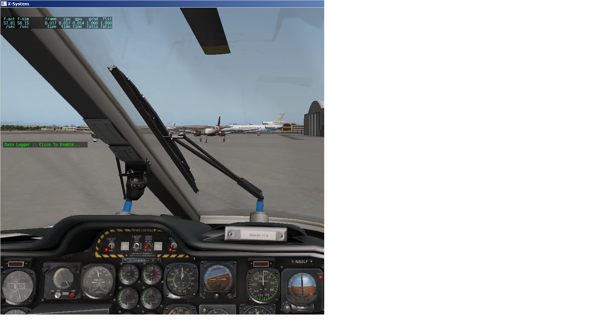
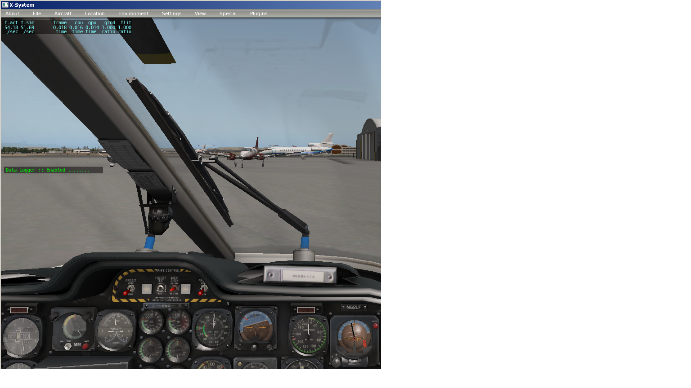

# DataLogger
An X-Plane plugin that saves GPS data to a log file locally in GPX format. The
contents of the file can then be used for multiple purposes, e.g. uploading to
an online flight analysis solution such as CloudAhoy.com.

# Usage
- Download and unzip
- Put the "DataLogger" folder in your X-Plane/Resources/plugins folder
- Start X-Plane
- To start and stop logging just click on the window.

# Notes
Each time you start and stop the logger a new GPX output file is created. The
default output directory is the root of your X-Plane folder.

When the plugin is installed for the first time a DataLogPath.txt file is created
in the root of your X-Plane folder if one doesn't already exist. You can use the
DataLogPath.txt file to specify an alternate output path by placing the desired
path on the first line of the file.

The plugin doesn't log redundant information. E.g. if you're not moving and
the Lat and Lon and Alt information hasn't changed from the previous samples the
plugin ignores the redundant information.

If you've not enabled the logger and you start taxing the "Click To Start" text
will blink for about ten seconds as a reminder.

# Logging window pics

